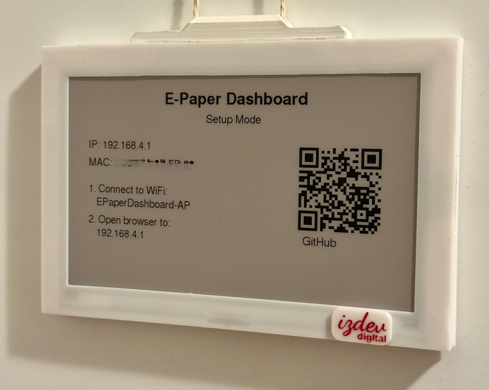
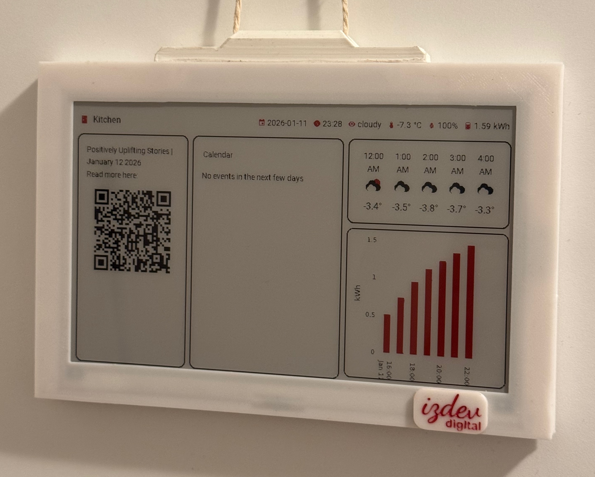
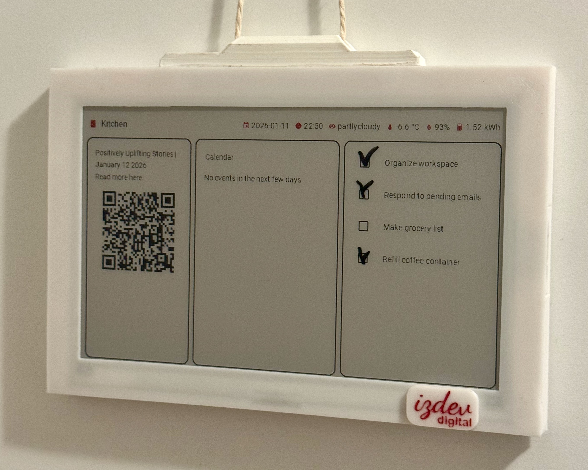

# izPanel

  
  
  

## What is izPanel?

**izPanel** is a reliable solution for displaying beautiful, dynamic dashboards on ultra-low-power E-Paper screens. Perfectly suited for [Home Assistant](https://www.home-assistant.io/) and other web-based dashboards, izPanel delivers real-time updates with impressive battery life—making it ideal for smart homes, personal automation, and ambient displays that actually *stay on*.

Whether you're tracking home automation metrics, displaying family schedules, monitoring weather, or showcasing custom dashboards, izPanel brings your digital information to E-Paper displays without the constant power drain of traditional screens.

### Why izPanel?

✨ **Ultra-Low Power** – Battery lasts for weeks, not hours  
🔄 **Zero Firmware Updates** – All changes happen on the server side  
📱 **Always Connected** – Seamless integration with Home Assistant and custom dashboards  
🎨 **Stunning Visuals** – Optimized rendering with color quantization and smart dithering  
🏠 **Made for Smart Homes** – Perfect for the modern connected home  
⚙️ **Plug & Play** – Simple setup with intuitive dashboard management  

## Technology Stack

izPanel is built on proven, modern technology:
- **Hardware**: ESP32-based microcontroller with optimized firmware
- **Server**: ASP.NET Core with [Playwright](https://playwright.dev/) for headless rendering
- **Rendering**: E-Paper-specific image processing with color optimization
- **API**: RESTful endpoints for seamless device communication
- **Database**: LiteDB for lightweight, embedded storage

## How It Works

The project consists of three integrated components working in perfect harmony:

### 1. [Firmware](firmware/)
**Smart E-Paper Device Software** – The brains of your hardware. Our optimized ESP32 firmware efficiently manages display refresh cycles, handles deep sleep modes, and securely communicates with the izPanel server. The result? Weeks of battery life per charge.

### 2. [Software](software/)
**izPanel Control Center** – A comprehensive ASP.NET Core web application that serves as the command center for your dashboards:
- Renders any web-based dashboard in real-time
- Processes and optimizes images for E-Paper displays
- Provides secure RESTful APIs for device communication
- Manages multi-device scheduling and synchronization
- Supports both local network and cloud deployments
- Built-in user authentication and dashboard management

### 3. [Packaging](packaging/)
**Beautiful Hardware Enclosures** – Professional CAD designs for 3D-printed enclosures that make your E-Paper display look as good as it functions.

## Key Features

🔋 **Extended Battery Life** – Weeks between charges thanks to intelligent E-Paper rendering and deep sleep optimization  
🏠 **Home Assistant Native** – Built specifically for Home Assistant, with seamless dashboard integration  
🔐 **Enterprise Security** – API key authentication with support for Home Assistant token-based auth  
📊 **Dynamic Content** – Update dashboard layouts and content without touching device firmware  
🎯 **Schedule-Driven Updates** – Configure custom update intervals per device, from minutes to hours  
💾 **Self-Hosted** – Full control of your data with easy Docker deployment  
🌐 **Network Flexible** – Works perfectly on home networks with optional cloud integration  
✅ **Production Ready** – Actively maintained with responsive community support

## Perfect For

- **Home Automation Enthusiasts** – Display your Home Assistant dashboards anywhere
- **Smart Home Monitoring** – Real-time weather, energy, or security dashboards
- **Family Coordination** – Shared calendars, schedules, and to-do lists
- **Office & Workspace** – Ambient metrics, status boards, and analytics
- **IoT Prototyping** – Flexible platform for custom dashboard projects

## Quick Start

1. **Deploy the software server** using Docker or the [Home Assistant Add-on](https://github.com/izdev-digital/hass-add-ons/tree/master/e-paper-dashboard)
2. **Flash the firmware** to your ESP32 device with E-Paper display
3. **Configure** your dashboard URLs and schedules through the web interface

For a step-by-step setup, see the [Quick Start Guide](quick-start/QUICK_START.md).

See individual component READMEs for detailed setup instructions.

## License

This project is licensed under the Apache License 2.0 - see the [LICENSE](LICENSE) file for details.