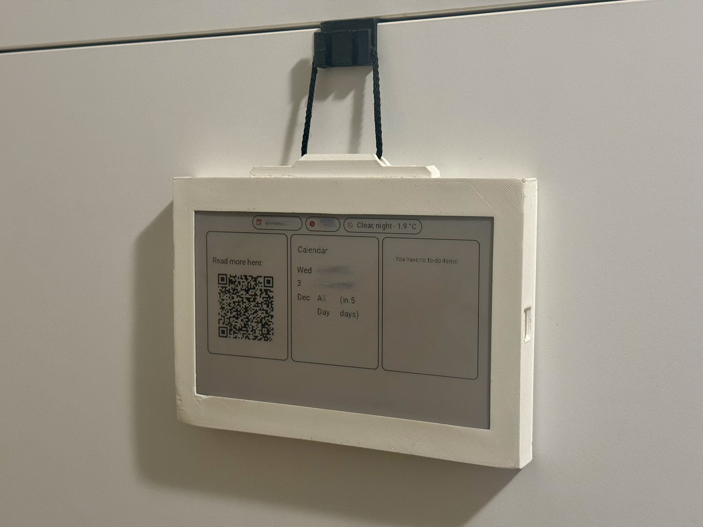

# E-Paper Dashboard

E-Paper Dashboard helps users display dynamic, web-based dashboards—such as [Home Assistant](https://www.home-assistant.io/) dashboards—on E-Paper screens, delivering scheduled updates with clear visuals and low power usage. Designed for smart homes and personal automation, this solution is currently intended for home networks and removes the need for manual firmware updates by allowing server-driven changes to dashboard content and layout. While functional, the solution has room for improvement and welcomes feedback and contributions.

The platform includes ESP32-based device firmware, an ASP.NET Core server for rendering and management, and hardware packaging resources. The server uses [Playwright](https://playwright.dev/) as its headless browser solution, along with E-Paper-specific image processing to prepare dashboard images. RESTful APIs support schedule-driven updates and centralized control of devices and dashboards. The project aims to be flexible and low-maintenance, but is still evolving and open to improvements.

## Architecture

The project consists of three main components:

### 1. [Firmware](firmware/)
ESP32-based firmware that manages the E-Paper display hardware and periodically polls the software server for updated dashboard images. The firmware handles display refresh cycles and deep sleep modes for power efficiency.

### 2. [Software](software/)
ASP.NET Core web application that:
- Renders Home Assistant dashboards (or custom URLs) using headless browser technology
- Processes rendered content with E-Paper-specific image optimization (color quantization, dithering)
- Provides RESTful API endpoints for firmware to retrieve processed images
- Manages scheduling and configuration for multiple dashboards and devices
- Supports user authentication and dashboard management

### 3. [Packaging](packaging/)
Hardware enclosure designs and assembly instructions for creating physical dashboard devices.

## Key Features

- **Built-in battery**: The device includes a rechargeable battery and can be charged via micro USB for portable, wireless operation.
- **Schedule-based polling**: Devices poll the server based on configurable schedules defined in the software
- **E-Paper optimized rendering**: Images are processed with color palette reduction and dithering algorithms tailored for E-Paper displays
- **No firmware updates required**: Dashboard content and layout changes are handled server-side
- **Home Assistant integration**: Designed to work with Home Assistant dashboards
  > **Note**: For best results, use kiosk mode for your dashboards and custom themes optimized for E-Paper displays based on color palette constraints.

## Scalability & Storage

This solution is currently intended for **small home networks** and personal use. It uses [LiteDB](https://www.litedb.org/) as an embedded database for simplicity and ease of deployment, making it ideal for environments where ease of setup and low maintenance are priorities.

## Quick Start

1. **Deploy the software server** using Docker or the [Home Assistant Add-on](https://github.com/izdev-digital/hass-add-ons/tree/master/e-paper-dashboard)
2. **Flash the firmware** to your ESP32 device with E-Paper display
3. **Configure** your dashboard URLs and schedules through the web interface

For a step-by-step setup, see the [Quick Start Guide](quick-start/QUICK_START.md).

See individual component READMEs for detailed setup instructions.

## License

This project is licensed under the Apache License 2.0 - see the [LICENSE](LICENSE) file for details.