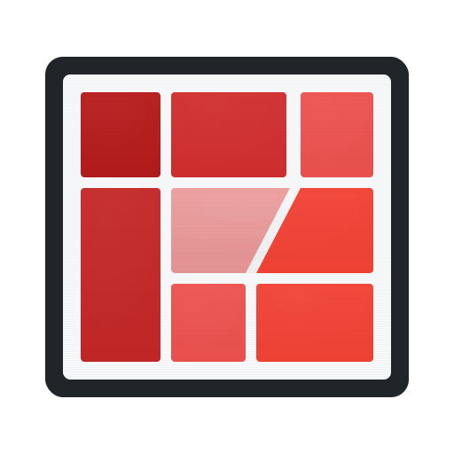

  

<h1 align="center">izBoard</h1>

Bring Home Assistant dashboards to an E-Paper display

  <a href="quick-start/QUICK_START.md">Quick Start</a> ·
  <a href="software/README.md">Software</a> ·
  <a href="firmware/README.md">Firmware</a>

**izBoard** displays your [Home Assistant](https://www.home-assistant.io/) dashboards on a battery-powered E-Paper device. The device automatically fetches updated dashboard images from a server on a schedule you control. The server converts your dashboards into the right format for the display. Because the device only uses power during updates, a single battery charge can last weeks or even months. See examples of the device and real dashboards below.

  
  
  

## Features
- Supports Home Assistant dashboard views
- ESP32-based device pulls rendered images on a schedule
- Web app to configure the device and schedule updates
- Long battery life: days to weeks depending on update schedule
- 7.5" black/white/red E-Paper display

## How It Works

izBoard has three components that work together:

**1. [Firmware](firmware/)** – Runs on the ESP32 device. Connects to the server, fetches dashboard images on schedule, displays them on the E-Paper screen, and goes to sleep to save battery.

**2. [Software](software/)** – Server application that renders your Home Assistant dashboards, converts them to E-Paper format, and serves them via API. Includes a web interface to manage devices and schedules.

**3. [Packaging](packaging/)** – 3D-printable enclosure designs for the device hardware.

## Quick Start

1. **Deploy the software server** using Docker or the [Home Assistant Add-on](https://github.com/izdev-digital/hass-add-ons/tree/master/e-paper-dashboard)
2. **Flash the firmware** to your ESP32 device with E-Paper display
3. **Configure** your dashboard URLs and schedules through the web interface

For a step-by-step setup, see the [Quick Start Guide](quick-start/QUICK_START.md).

See individual component READMEs for detailed setup instructions.

## License

This project is licensed under the Apache License 2.0 - see the [LICENSE](LICENSE) file for details.