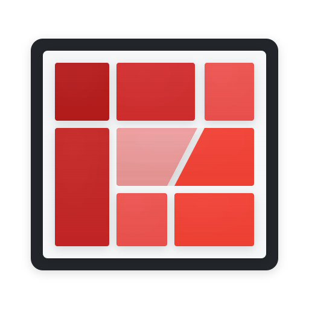
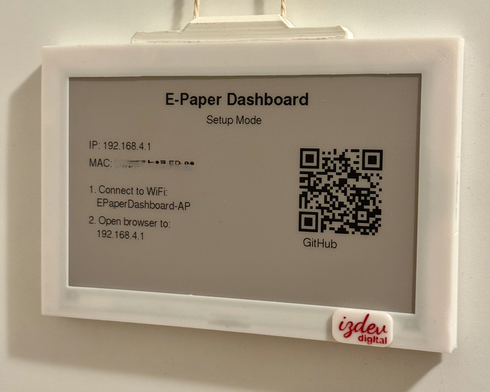
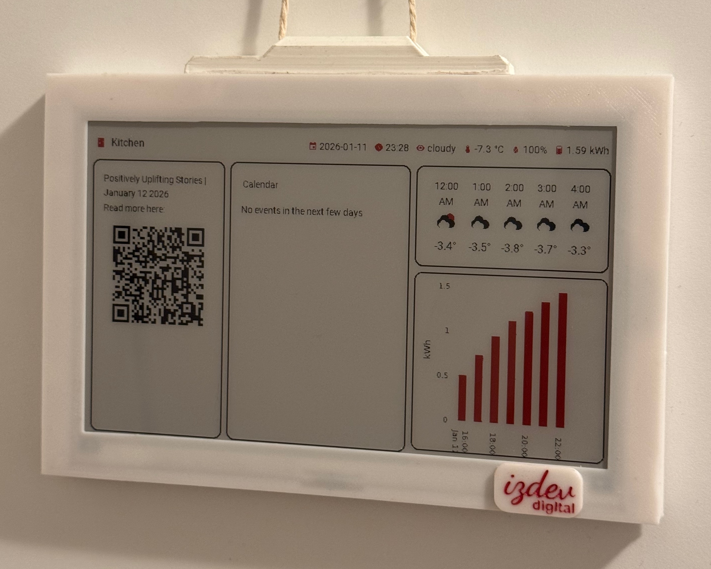
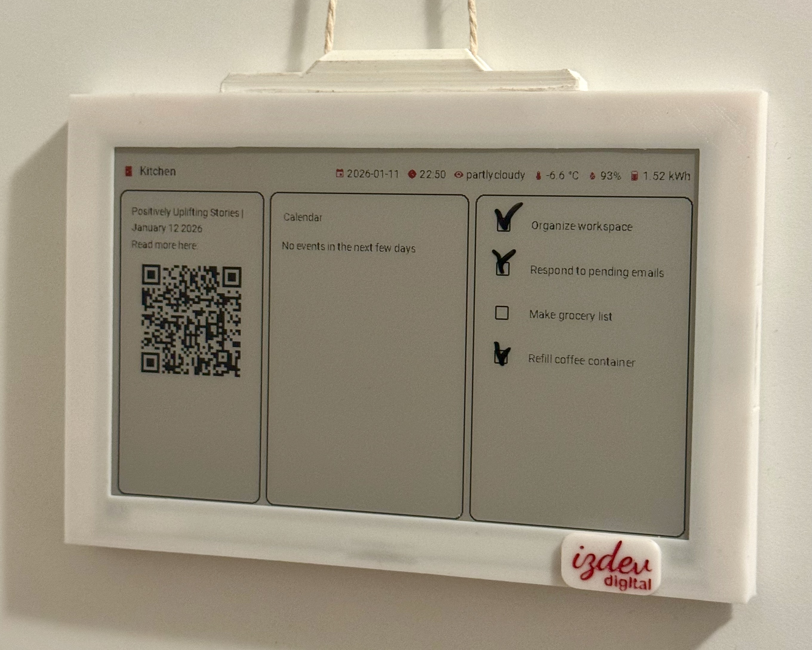

  

<h1 align="center">izBoard</h1>

Bring Home Assistant dashboards to an E-Paper display

  <a href="software/README.md">Software</a> ·
  <a href="firmware/README.md">Firmware</a> ·
  <a href="packaging/README.md">Packaging</a>

**izBoard** displays your [Home Assistant](https://www.home-assistant.io/) dashboards on a battery-powered E-Paper device. The device automatically fetches updated dashboard images from a server on a schedule you control. The server converts your dashboards into the right format for the display. Because the device only uses power during updates, a single battery charge can last weeks or even months. See examples of the device and real dashboards below.

  
  
  

## Features

- Visual dashboard designer with multiple widget types
- Home Assistant integration
- E-Paper optimized image processing
- Configurable update schedules with deep sleep for long battery life
- Secure device pairing and OTA firmware updates
- Deploy as standalone Docker or Home Assistant Add-on
- Multi-user support with administration (standalone mode)

## How It Works

izBoard has three components that work together:

**1. [Firmware](firmware/)** – Runs on the ESP32 device. Connects to the server, fetches dashboard images on a schedule, displays them on the E-Paper screen, and deep-sleeps to save battery. Handles OTA firmware updates, secure device pairing, and initial setup via a captive portal.

**2. [Software](software/)** – ASP.NET Core server application with an Angular web interface. Renders dashboards as E-Paper-optimized images, manages devices and schedules, and integrates with Home Assistant. Runs in Docker or as a Home Assistant Add-on.

**3. [Packaging](packaging/)** – 3D-printable enclosure designs for the device hardware.

## Getting Started

1. **Deploy the server** using Docker (see [Software README](software/README.md)) or the [Home Assistant Add-on](https://github.com/izdev-digital/hass-add-ons/tree/master/e-paper-dashboard)
2. **Flash the firmware** to your ESP32 device with an E-Paper display (see [Firmware README](firmware/README.md))
3. **Pair the device** — power on the ESP32, connect to its setup portal, and enter the pairing code from the web interface
4. **Create a dashboard** — use the visual designer or connect a Home Assistant dashboard view
5. **Assign the dashboard** to your device and configure the update schedule

See the individual component READMEs for detailed setup instructions.

## License

This project is licensed under the GNU Affero General Public License v3.0 (AGPL-3.0) — see the [LICENSE](LICENSE) file for details.

### Third-Party License Notice

This software uses [SixLabors.ImageSharp](https://github.com/SixLabors/ImageSharp), which is subject to the [Six Labors Split License](https://www.sixlabors.com/pricing/). Commercial entities with gross annual revenue exceeding $1M USD may require a separate commercial license from Six Labors. See https://sixlabors.com/pricing/ for details.