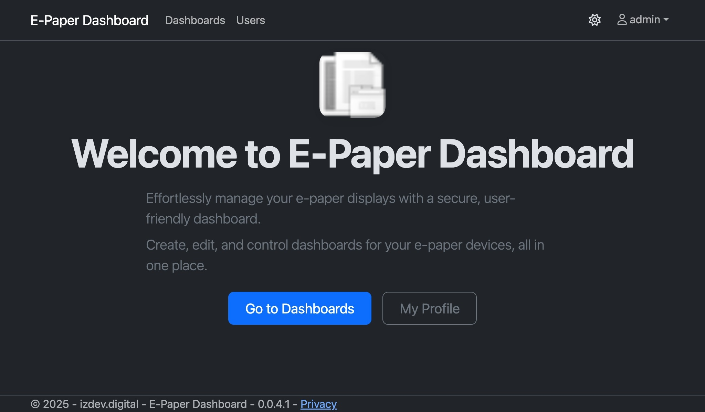
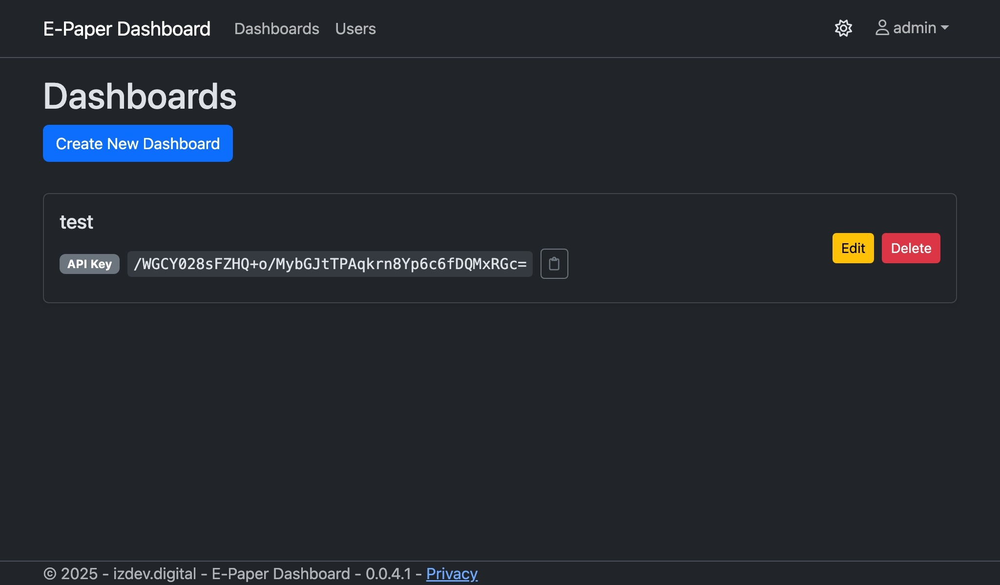
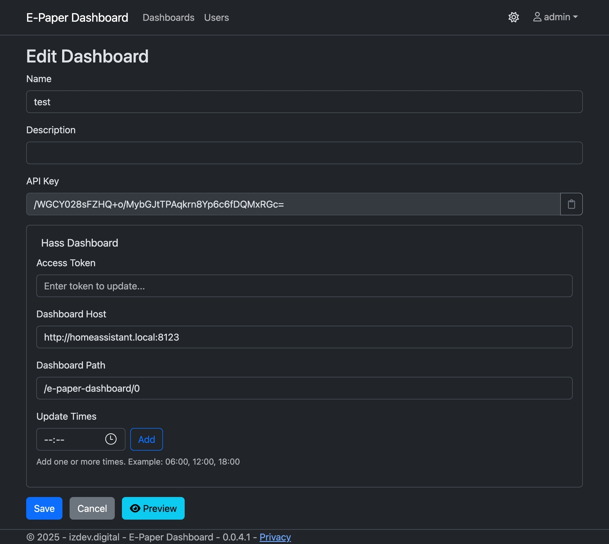
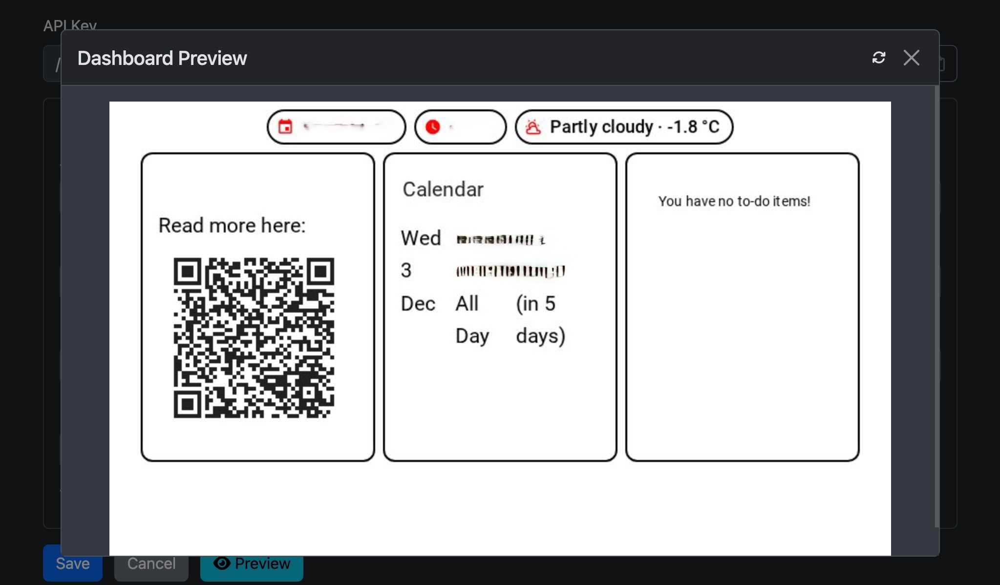
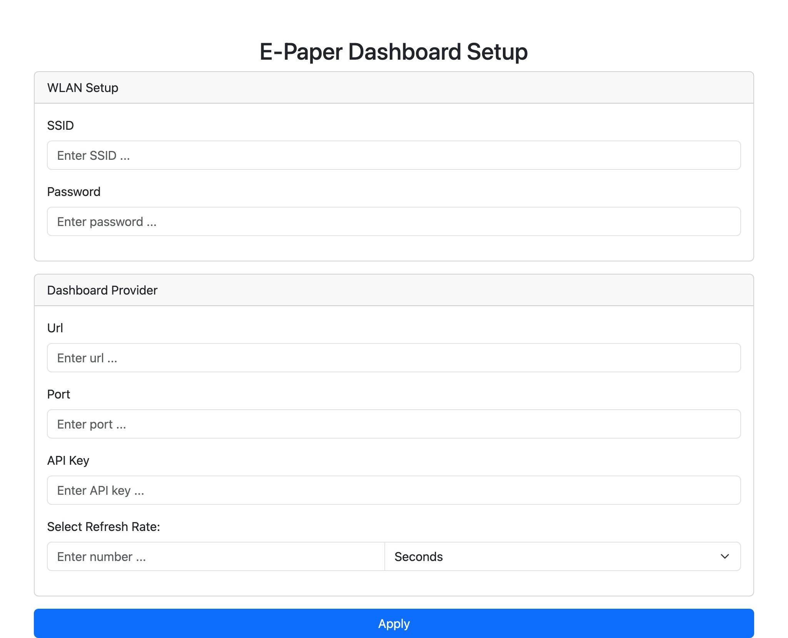

# Quick Start Guide

This guide will help you create your first dashboard and set up your e-paper device.

> **Note:** Some details in the images below are intentionally blurred for privacy reasons.

---

## 1. Create Dashboard

- Open the home page of the dashboard server:

- Navigate to the dashboard overview:

---

## 2. Edit Dashboard

- Click "Create Dashboard" and fill in the required fields:

- Specify the hours when the dashboard should be updated.

---

## 3. Save and Preview

- Save the dashboard.
- If everything is correct, a preview will be shown:

---

## 4. Setup Device

- Power on your device for the first time.
- The device will create a WiFi Access Point (AP).
- Connect to the AP using your phone or computer.
- Navigate to the device setup page (see image below):

- Enter your WiFi SSID and password.
- Enter the URL of your e-paper dashboard server.
- Create a dashboard in the web interface and copy the API key.
- Enter the API key in the device setup page.

---

You're all set! Your device will now display the dashboard and update according to your settings.